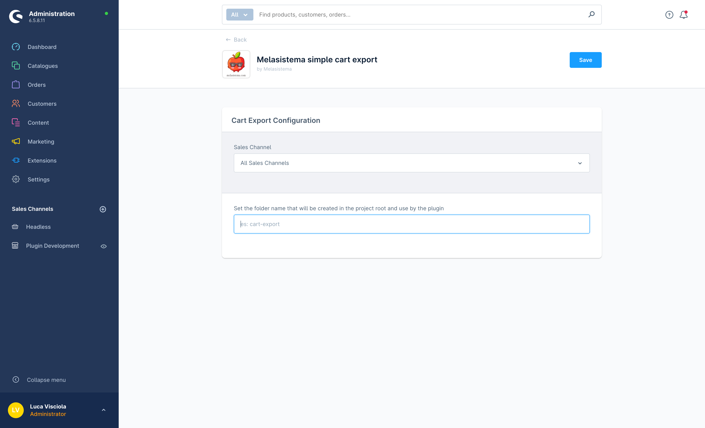
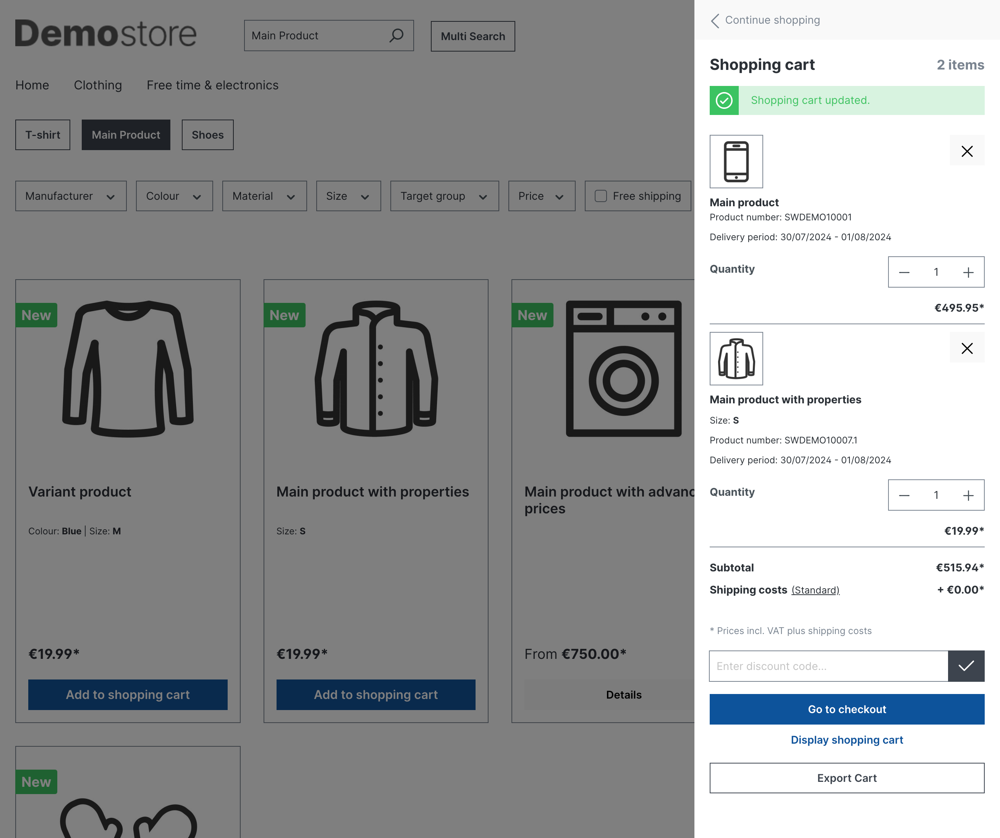

## Simple Cart Export for Shopware

### Easily export your shopping cart contents as a CSV file for logged-in customers!

This plugin provides a straightforward way to export the current cart contents as a CSV file in Shopware 6 for logged in customers. It leverages the `%kernel.project_dir%` variable and `Simfony FileSystem` to save the exported cart data to the root directory of your project.

**Ideal for:**

Small and medium-sized e-commerce stores with low to moderate traffic
Quick and convenient cart data export for analysis or record-keeping

-   Small and medium-sized e-commerce stores with low to moderate traffic
-   Quick and convenient cart data export for analysis or record-keeping

**Key Features:**

-   **Lightweight and Efficient:** Streamlined code minimizes resource usage, making it perfect for lower-traffic stores.
-   **No Database Alterations:** No need to modify your Shopware database, ensuring a clean and hassle-free setup.
-   **Simple Installation:** Easy integration into your Shopware project.
-   **Open-Source and Customizable:** Modify the plugin's code to fit your specific needs.

**Important Considerations:**

- This solution is best suited for stores with low to moderate cart activity. For high-traffic websites with frequent cart updates, exploring alternative methods is recommended.
- The exported CSV file is saved to the plugin's designated directory within the Shopware project root. Be mindful of security implications for sensitive data on high-traffic stores.

**Installation:**

1.  **Obtain the Plugin:** Clone the repository using Git or download the plugin files directly.
2.  **Place in Project:** Copy the plugin files into the `custom/plugins` folder within your Shopware project's root directory.
3.  **Activate the Plugin:** Within the Shopware administration panel, go to **Configuration** > **Plugin Management**. Locate the "Simple Cart Export" plugin and activate it.
4.  **Clear Cache:** Ensure a clean slate by clearing the Shopware cache after plugin activation.
5.  **Set Folder Name (Optional):** Access the plugin configuration to define a custom folder name for storing exported CSV files.

**Usage:**

- The export cart button is conveniently located within the off-canvas cart actions.
- Additionally, you can integrate the export functionality into your theme's checkout pages using the provided Twig template: ``

**License:**

This plugin is distributed under the terms of the GPLv2 or later (GPL). Please refer to the [LICENSE](http://www.gnu.org/licenses/gpl-2.0.html) file for more details.

**Additional Notes:**

